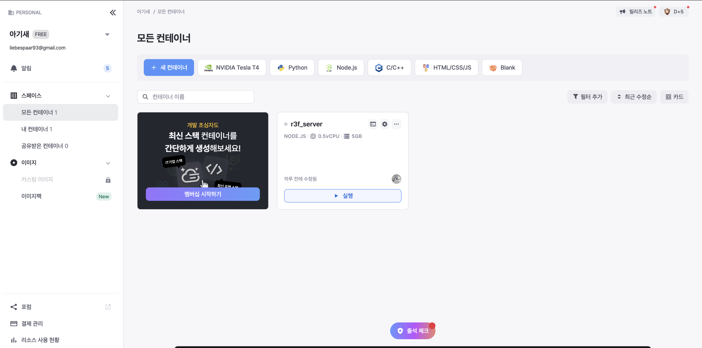
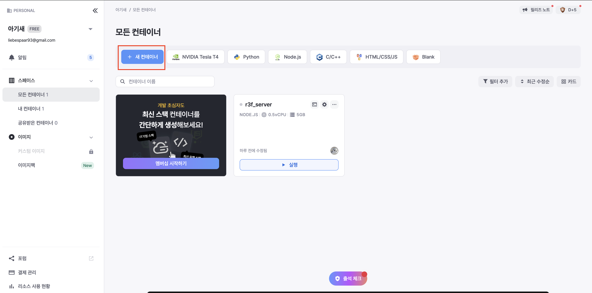
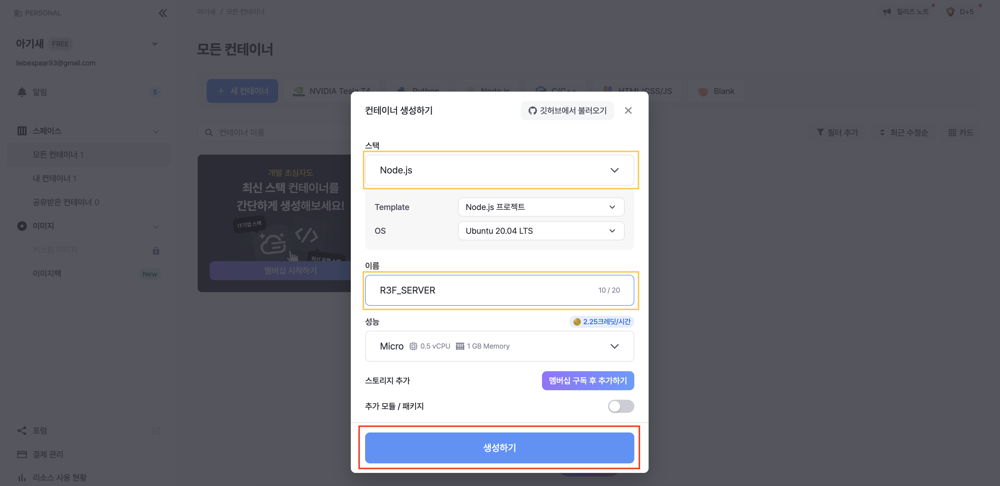
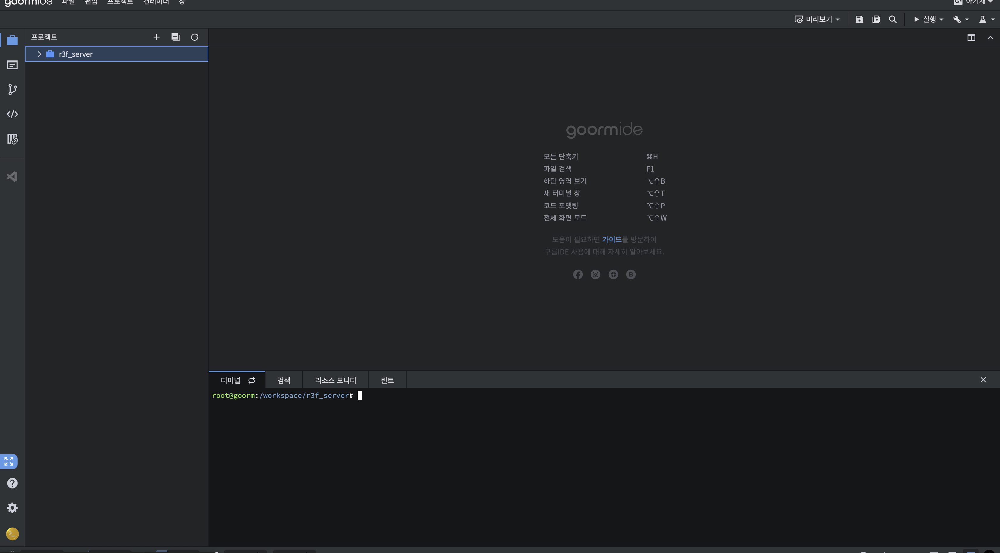
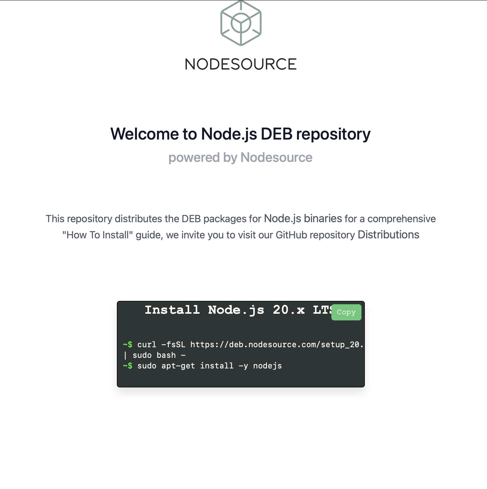
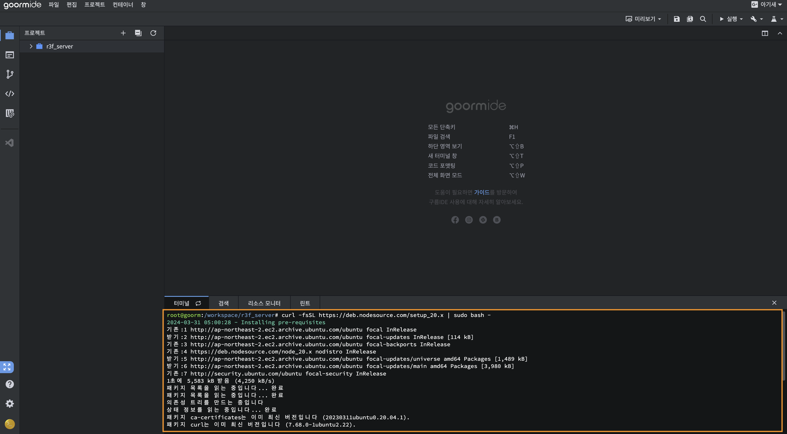

# 구름(groom)을 사용한 서버 올리기

## 구름 EDU 접속하기

[](https://goorm.io/)

링크 : [https://goorm.io/](https://goorm.io/)

## Google을 통한 로그인


## IDE 데시보드 접속하기




### 새컨테이너 만들기







### node 20 버전 이상 환경 세팅해주기


🔗 링크 : [https://deb.nodesource.com/](https://deb.nodesource.com/)

```bash
sudo apt-get update
curl -fsSL https://deb.nodesource.com/setup_20.x | sudo bash -
sudo apt-get install -y nodejs
```



> [!TIP]
> 환경 정보 확인

```bash
$ node -v
v20.12.0
```

### Server 실행

> [!TIP]
> ```https://github.com/liebespaar93/R3F_SERVER``` 을 이용시 ```git clone``` 할 것

```bash
npm i 
npx next-ws-cli@latest patch
npm run build
npm run start
```

🍝 env 세팅

```env
NEXT_PUBLIC_SOCKET_URL="ws://{현재주소 작성}"
```
